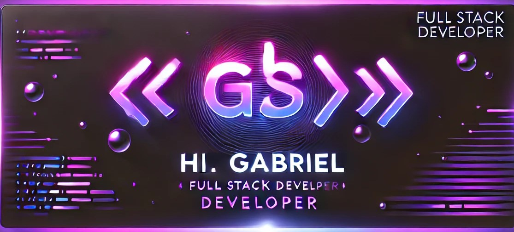

# Perfil GitHub de Gabriel França

❤️ Sou apaixonado por desenvolver soluções inovadoras em tecnologia.    Como programador full stack e freelancer, combino conhecimento técnico e criatividade para desenvolver soluções personalizadas em diferentes plataformas. Seja para aplicações web, desktop ou mobile, estou preparado para transformar ideias em projetos de alta qualidade. Vamos criar algo incrível juntos!

---

## 🌟 Destaques

- **Desenvolvedor Freelancer:** Criação de sites, aplicativos mobile e softwares desktop sob medida para clientes, com soluções personalizadas e alto padrão de qualidade.
- **Aprendendo:** Machine Learning, com foco em aplicar inteligência artificial para resolver problemas complexos e criar sistemas mais inteligentes e eficientes.

---

## 🛠️ HardSkills

### Linguagens de Programação e Frameworks:

 
  
  
  
  
  
  
  
  

### Bancos de Dados:

 
  
  

---

  <a href="https://github.com/NeroWasTrolled">
  
  

    
---

## 🌐 Conecte-se Comigo:

### Redes Sociais

  
  
  
  

### Meu Site

  

---
